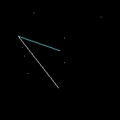
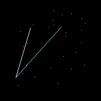
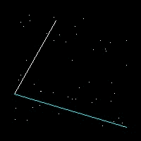

# Jarvis March or Gift Wrapping Algorithm

Given a set of points in the plane. the convex hull of the set is the smallest convex polygon that contains all the points of it. Jarvis March is one of many algorithm to compute a convex hull. 

Below are some examples of how the algorithm works.

### Demonstration

 
 
 

**10 points** &nbsp;&nbsp;&nbsp;&nbsp;&nbsp;&nbsp;&nbsp;&nbsp;&nbsp;&nbsp;&nbsp;&nbsp;&nbsp;&nbsp;&nbsp;&nbsp;&nbsp;&nbsp;&nbsp;&nbsp;&nbsp;&nbsp;&nbsp;&nbsp;&nbsp;&nbsp;&nbsp;&nbsp;&nbsp;&nbsp;&nbsp;    **30 points** &nbsp;&nbsp;&nbsp;&nbsp;&nbsp;&nbsp;&nbsp;&nbsp;&nbsp;&nbsp;&nbsp;&nbsp;&nbsp;&nbsp;&nbsp;&nbsp;&nbsp;&nbsp;&nbsp;&nbsp;&nbsp;&nbsp;&nbsp;&nbsp;&nbsp;&nbsp;&nbsp;&nbsp;&nbsp;&nbsp;&nbsp;&nbsp;&nbsp;&nbsp; **50 points**
### Usage

`python3 jarvis.py `

**Optional Parameters**
` --save` : _Writes the final image on disk._
`--visualize` : _Shows the process of the algorithm through a series of images._
`num_of_points` : _Define the number of points that should be generated. Minimum value is `3`._
`img_height` : _Define the height of the image._
`img_width` : _Define the width of the image._
`padding` : _Define the padding value. Padding is used to control the how close the generated points should be to the borders of the image._

License
----

MIT
